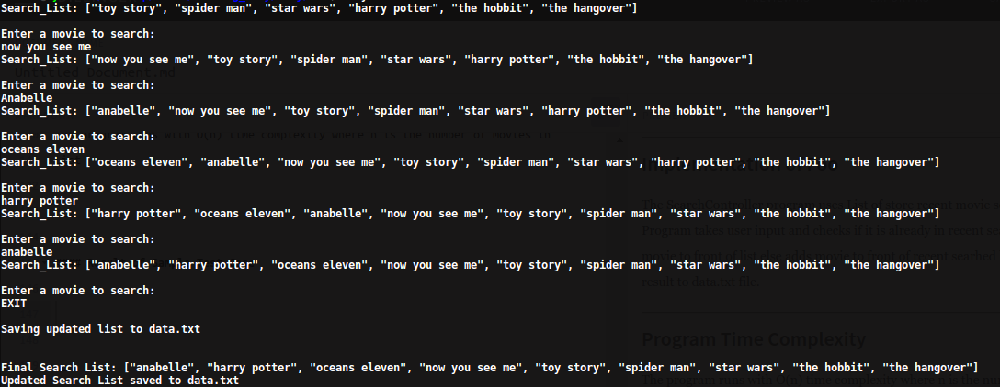

# SearchController Program 

SearchController program uses List to store recent movie searches made by user

* Latest search is at the front of List.
* List stores unique movie entries
* Stores the final list in file.

### Quick start

> Clone/Download the solution then run `main.rb`

```
# Download all files from canvas

# For Mac OSX
$ ruby main.rb

```

# Table of Contents
* [SearchController chapter](#SearchController-chapter)
* [License](#license)
* [Author](#author)

#### SearchController chapter

The SearchController program uses List of store recent movie searches made by user.

___


#### SearchController Class

SearchController class maintianing searchSuggestionList and functions to 
add and remove movies from searchSuggestionList and saving to file

```
class SearchController

	attr_accessor :searchSuggestionList

	def initialize(search_list = [])
		# initialize the list with input argument
		@searchSuggestionList = search_list
  	end

	def showList()
		# return the list to main file
		return @searchSuggestionList
	end

	def updateList(movie_name)
		# check if movie is already in list
		if @searchSuggestionList.include?(movie_name.downcase) == true
			# if present delete the movie
			@searchSuggestionList.delete(movie_name.downcase)
		end
		# add the movie to front of list
		@searchSuggestionList.unshift(movie_name.downcase)
	end

	def saveListToFile()
		##### 
		
		puts "\n\nFinal Search List: #{@searchSuggestionList}\n"

		# 1.save updated search suggestion list to "data.txt" file 
		# open file to put the list
		File.open("data.txt", "w+") do |f|
  			# write movies in file one by one
  			@searchSuggestionList.each { |element| f.puts(element) }
		end
		
		puts "Updated Search List saved to data.txt\n"

		#####
	end

end

```
___

#### Main File

Main file creating SearchController object and taking user input to edit search list by calling methods of SearchController class

```
require_relative 'search_controller.rb' 


# Initialize default list ...
defaultSearchList = ["toy story", 
						"spider man", 
						"star wars", 
						"harry potter", 
						"the hobbit", 
						"the hangover"]

# Let first search_controller get default list
controllerObject = SearchController.new(defaultSearchList)
puts "Search_List: #{controllerObject.showList()}"

##### 

# 1.create endless loop
while true
	# 2.get an input from terminal(console)
	puts "\nEnter a movie to search: "
	userInputMovie = gets.chomp
	# 4.loop should end when user write "exit"
	if userInputMovie.downcase == "exit"
		break
	end

	# 3.update search suggestion list
	controllerObject.updateList(userInputMovie)
	puts "Search_List: #{controllerObject.showList()}"

end


# 5.save updated "searchSuggestionList" to "data.txt" file
puts "\nSaving updated list to data.txt"
controllerObject.saveListToFile()

```
___

#### Implementation of Foo

The SearchController program uses List of store recent movie searches made by user.
Program takes user input and checks if it is already in recent searches, if present moves the searched movie to front of list else adds movie to front of recent searhed list. when search is over, saves the result to data.txt file.

___

#### Program Time Complexity

The program runs with O(n) time complexity where n is the number of movies in 
List

___

#### Result of Sample Test Case




___

#### License
 [Auburn University](/LICENSE)

___

## Author
 [Junhao Wang](/LICENSE)


